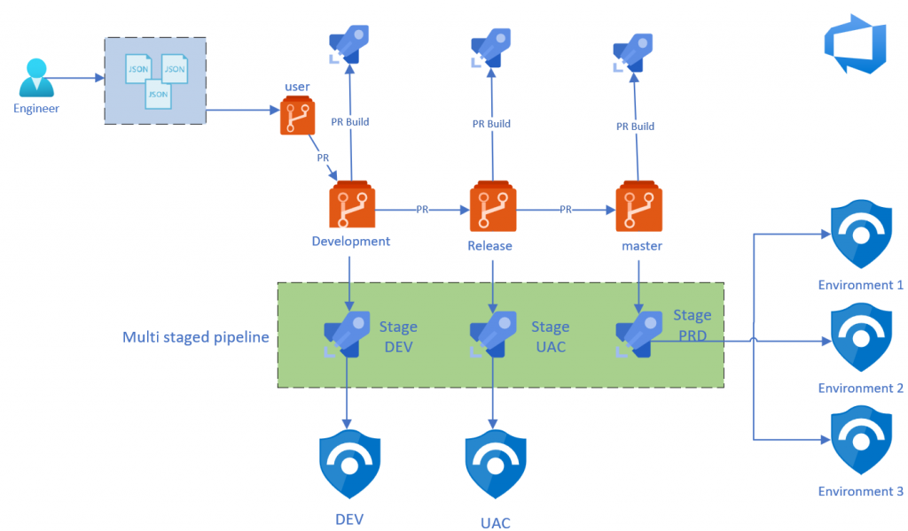

  

# Deploying and Managing Azure Sentinel – Ninja style
A couple of months ago Javier and Philippe wrote a great blog on how to deploy, configure and maintain Azure Sentinel through Azure DevOps with IaC using AzSentinel. We are now a couple of months further and more and more functions are integrated in AzSentinel.
So I decided to create a new Azure DevOps Pipeline which covers more than only the "deployment" part. I want to show that Pipelines are more than only deployment "tools" and they need to be implemented the right way with the right DevOps mindset for the best result. Or as I call it in this  post Ninja style :P **You can rad the complete post on my [blog](https://pkm-technology.com/?p=2373&preview=true&_thumbnail_id=2315)**

## The story behind DevOps and Pipelines
Before we go deeper into the technical side, I first like to mention the idea behind it all. The reason I've invested so much time in order to build AzSentinel and DevOps pipelines. The main reason was to implement the "shift left" WoW. The term “shift left” refers to a practice in software development, in which teams focus on quality, work on problem prevention instead of detection, and begin testing earlier than ever before. The goal is to increase quality, shorten long test cycles and reduce the possibility of unpleasant surprises at the end of the development cycle—or, worse, in production. Azure Portal is a great portal, but when you log in and by accident remove or change an Analytic rule for example without any testing, approving or 4-eye principle, then you really have a challenge. You will probably find out something went wrong when you are troubleshooting to see why nothing happened in first place. And don't we all know that's way too late...

Shifting left requires two key DevOps practices: continuous testing and continuous deployment. Continuous testing involves automating tests and running those tests as early and often as possible. Continuous deployment automates the provisioning and deployment of new builds, enabling continuous testing to happen quickly and efficiently.

## Azure Sentinel deployment Ninja style

Based on the shift left and DevOps WoW, I made the following design on how I think the process should look like. I will explain the design you see below in different parts.

## Links
- Read the complete post on my [blog](https://pkm-technology.com/?p=2373&preview=true&_thumbnail_id=2315)
- Read blog post from Javier and Philippe on [techcommunity](https://techcommunity.microsoft.com/t5/azure-sentinel/deploying-and-managing-azure-sentinel-as-code/ba-p/1131928)

## Contributing

Please read [CONTRIBUTING.md](CONTRIBUTING.md) for details on our code of conduct, and the process for submitting pull requests to us.

## Author

* **Pouyan Khabazi** - *Developer and Maintainer* - [GitHub](https://github.com/pkhabazi) / [Blog](https://pkm-technology.com)

See also the list of [contributors](https://github.com/pkhabazi/sentineldevops/contributors) who participated in this project.

## Versioning

We use [SemVer](http://semver.org/) for versioning. For the versions available, see the [tags on this repository](https://github.com/pkhabazi/sentineldevops/tags).

## License

This project is licensed under the MIT License - see the [LICENSE](LICENSE) file for details
